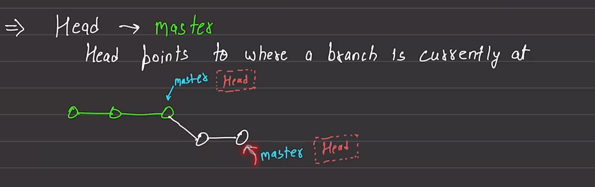
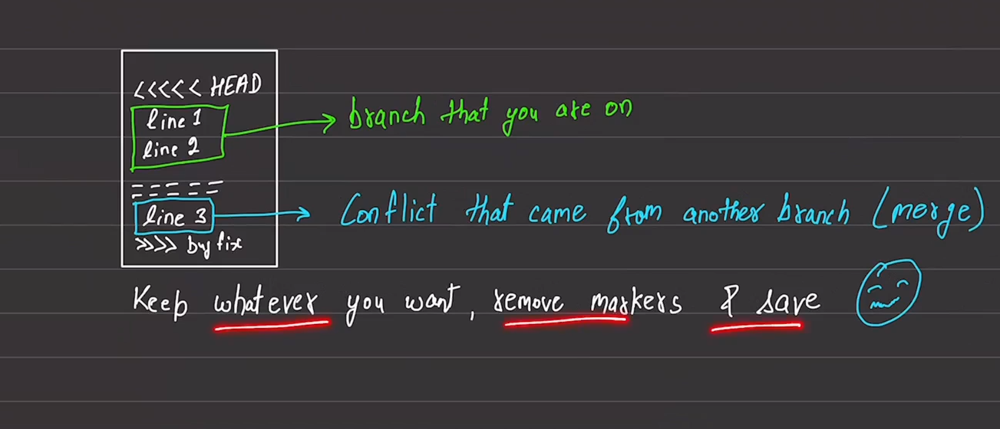

- Repo os just a folder that contains a project.

## Initialising a repo

- Git software just because it is installed on the PC does not make it record everything. You have to initialise a repo.

- cd to a particular folder, then:
- `git status` - to check whether the repo is initialised.
- `git init` - to initialise a repo. It is run one time per project. this command creates a hidden folder called `.git`. Never touch it manually.

## Working with a repo

- You work on your project. Then when you want to save your work, you do a commit. It is like saving progress in computer games.
- The whole idea is we write, we add, we commit, we push.

- `git add <filename>` - to add a file to the staging area. You can add multiple files or all files using `.`. Staging area is like a prescreen in games like do you really want to save your game.
- `git commit -m "commit message"` - to commit the changes.
- `git push` - to push the changes to the remote repo.

## Atomic commits

- One commit does one job - atomic commits.
- You commit often. And you commit after every achieved task

## Git Ignore

- Whenever you are building a project, you will have sensitive information like API keys, etc stored in environment variables.
- You don't want to commit these to the repo.
- You can create a `.gitignore` file in the root of the project and add the files you want to ignore. You can also add folders.
- You can also use the `git ignore` command to ignore files.
- You can also use the `git ignore -a` command to add all files to the ignore list.
- You can also use the `git ignore -f` command to unignore a file.
- You can also use the `git ignore -l` command to list all ignored files.

## Git internal workings

- In Git every commit has an associated commit hash generated by the SHA-1 hash function. This hash is also called id of that commit.
- The hash is generated based on the hash of the previous commit as well(except for the first commit) and the changes made in the current commit.
- This is exaclty the mechanism that allows us to visit back in time.

## Git Branches

### Creating a branch

- `git branch <branchname>` makes a new branch
- `git checkout <branchname>` switches to the branch. Instead of checkout you can use `git switch <branchname>` as well.
- then work on that branch
- `git add .` then `git commit -m "commit message"` to save the changes
- Head points to where a branch is currently at ie latest commit in the branch
  
- always commit before switching branches

### Merging a branch

- checkout to the main branch to which you want to bring other branch ie mostly `git checkout master`
- `git merge <branchname>` - this will merge <branchname> into the current branch

### Merging with conflicts

- The code from main branch is shown above and the code from the branch to be merged is shown below
- The whole point of resolving conflict is which part of the code you want to keep - that is all. We can also keep both parts of the code as well
- If two people are working then there is no easy way to do it you have to consult with the other person manually
  
- I have bookmarked it in the course as well can refer to it later

## Remote Repos

- Left the videos
