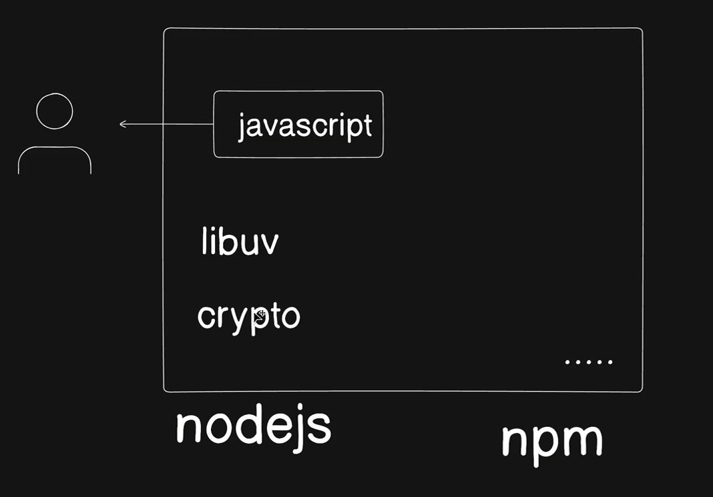

## Node.js

- Servers communicate with frontend via API.
- Earlier we saw how to make API calls from frontend, now we will see how we can make servers that handle requests and provide responses.
- We cannot just use vanilla JS to make servers, because the JS was made for frontend and hence does not have the fucntionality such as interacting with network, file system etc. Hence we use Node.js to make servers.
  

### Node.js

- The coder just writes JavaScript code and runs it.
- Node.js is a runtime environment that allows us to run JS code outside of the browser.
- NPM is the package manager for Node.js.
- Just like there are libraries in python example pytorch, there are modules in Node.js for example express that give additional functionality.

### Bun

- Bun was also taught.

### Express

- Express is a library for Node.js that makes it easier write routes ie /coffee, /ice-tea etc.

### Hono

- Hono is also a similar library like express. Here similar code can run in node, bun and browser etc

## Nginx

- Before Apache was the most popular web server, now Nginx has taken over the world like a storm.
- It serves static files like images, css, js, html etc.
